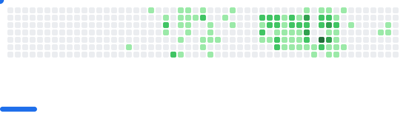

# 🏃‍♂️ About Me:
I’m a Math & CS student at UC San Diego, passionate about blending technical precision with creative problem-solving. Either it be for my computer science classes or my work with clubs that I'm involved with, I love creating solutions to interesting problems. I'm currently active in clubs like Triton Consulting Group @ UCSD! 

Outside of coding, I love playing basketball, going on runs, and listening to music! Feel free to message me on my socials about anything!!

## 🧑‍💻 What I'm Working On:
I'm currently working as a `Full Stack Development Intern` at <ins>__BusinessRate__</ins> creating full stack apps using things like `Typescript`, `Prisma`, and `Postgres`, and I am in the process of learning Go!

Check out [my website](https://spencercowles.com) :)

# 💻 Tech Stack:
                      
# 📊 GitHub Stats:

  
  

<picture>
  <source
    media="(prefers-color-scheme: dark)"
    srcset="images/breakout-dark.svg"
  />
  <source
    media="(prefers-color-scheme: light)"
    srcset="images/breakout-light.svg"
  />
  
</picture>

<!-- Proudly created with GPRM ( https://gprm.itsvg.in ) -->
<!-- Proudly created with GPRM ( https://gprm.itsvg.in ) -->
